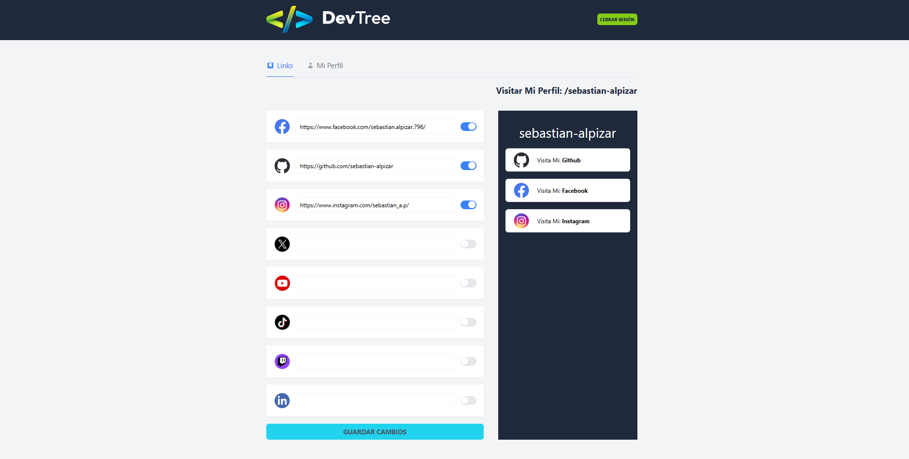

# Social Link Hub
Clon de Linktree — SPA con Node.js (Express) + React + TypeScript

## Descripción General
Dev Tree es una aplicación web tipo Single Page Application (SPA) que permite a los usuarios crear un perfil público donde pueden centralizar todos sus enlaces a redes sociales y plataformas digitales en un solo lugar.

El sistema permite a cualquier usuario:
- Registrar una cuenta
- Elegir un handle único (como en Twitter, Instagram o GitHub)
- Personalizar su perfil con imagen y descripción
- Administrar y ordenar enlaces a redes sociales
- Compartir su perfil público mediante una URL única

Dev Tree funciona como un Software as a Service (SaaS) donde múltiples usuarios pueden registrarse y gestionar su propio perfil de forma independiente.

Incluye:
- Registro y login de usuarios
- Validación de handles únicos
- Edición de perfil (handle, descripción, imagen)
- Gestión de enlaces a redes sociales
- Reordenamiento de enlaces por drag & drop
- Habilitar / deshabilitar enlaces
- Perfil público accesible por URL
- Subida de imágenes con Cloudinary
- SPA moderna con React + TypeScript
- API REST con Node.js, Express y MongoDB

## Características Principales

- Registro y autenticación de usuarios con JWT
- Handles únicos (no se permiten duplicados)
- Página pública de perfil tipo Linktree
- Búsqueda de disponibilidad de handles desde la página principal
- Edición de perfil (handle, descripción e imagen)
- Subida de imágenes usando Cloudinary
- Gestión de enlaces a redes sociales (Facebook, GitHub, Instagram, X, LinkedIn, YouTube, TikTok, Twitch)
- Validación de URLs
- Habilitar y deshabilitar enlaces sin perder información
- Reordenamiento de enlaces con Drag & Drop
- SPA 100% dinámica con React
- Consumo de API con React Query
- Diseño moderno con Tailwind CSS

## Tecnologías Utilizadas
### Backend

- Node.js
- Express
- TypeScript
- MongoDB Atlas
- Mongoose
- JWT (JSON Web Tokens)
- Cloudinary (almacenamiento de imágenes)
- CORS
- Arquitectura modular (config, middleware, handlers, models)

### Frontend

- React
- TypeScript
- Vite
- React Router DOM
- React Query
- Axios
- Tailwind CSS
- Drag & Drop Kit (DND Kit)

### Tooling

- Git & GitHub
- Node.js
- NPM
- ESLint

## Arquitectura del Proyecto

El proyecto está dividido en dos módulos principales:

### Backend (Node.js + Express)
```bash
backend/
│── src/
│   ├── config/        → Configuración (DB, CORS, Cloudinary)
│   ├── handlers/      → Lógica de endpoints
│   ├── middleware/    → Autenticación y validaciones
│   ├── models/        → Modelos Mongoose
│   ├── utils/         → JWT, helpers de auth
│   ├── router.ts      → Definición de rutas
│   ├── server.ts      → Configuración del servidor
│   └── index.ts       → Entry point
│── package.json
│── tsconfig.json
```
Componentes clave:
- Model: User
- Middleware: auth, validation
- Utils: jwt, auth
- Config: db, cors, cloudinary

### Frontend (React SPA)
```bash
frontend/
│── public/
│   ├── social/        → Íconos de redes sociales
│   └── assets visuales
│── src/
│   ├── api/           → Cliente API (Axios)
│   ├── components/    → Componentes reutilizables
│   ├── config/        → Configuración Axios
│   ├── data/          → Catálogo de redes sociales
│   ├── layouts/       → Layouts (Auth / App)
│   ├── views/         → Vistas principales
│   ├── router.tsx     → Rutas de la app
│   └── main.tsx       → Entry point
```
Vistas principales:
- Home (búsqueda de handle)
- Login
- Registro
- Perfil (edición)
- Gestión de enlaces
- Vista pública del Dev Tree
- Página 404 (Not Found)
- Aprobación de Médicos (Admin)

## Requisitos Previos

Asegúrate de tener instalado:
### Backend
- Node.js >= 18
- NPM
- Cuenta en MongoDB Atlas
- Cuenta en Cloudinary

### Frontend
- Node.js >= 18
- NPM

## Instalación
1. Clonar el repositorio

```bash
git clone https://github.com/sebastian-alpizar/social-link-hub.git
cd social-link-hub
```

### Configuración del Backend (Spring Boot)

2. Crear archivo `.env` en /backend:
```bash
FRONTEND_URL=http://localhost:5173
MONGO_URI=TU_URI_DE_MONGODB
JWT_SECRET=TU_SECRET_JWT
CLOUDINARY_NAME=TU_CLOUDINARY_NAME
CLOUDINARY_API_KEY=TU_API_KEY
CLOUDINARY_API_SECRET=TU_API_SECRET
```

3. Instalar dependencias y ejecutar backend:
```bash
cd backend
npm install
npm run dev
```
Backend por defecto:
```bash
http://localhost:4000
```

### Configuración del Frontend
4. Crear archivo `.env` en `/frontend`:
```bash
VITE_API_URL=http://localhost:4000
```

5. Instalar dependencias y ejecutar frontend:
```bash
cd frontend
npm install
npm run dev
```

El frontend se ejecutará típicamente en:
```bash
http://localhost:5173
```

## Comunicación del Sistema

Flujo General

- El usuario ingresa a la página principal
- Busca un handle
- Si el handle está disponible:
  Puede registrarse automáticamente con ese handle
- El usuario crea su cuenta
- Inicia sesión
- Accede a su panel de administración
- Edita su perfil (imagen y descripción)
- Agrega enlaces a redes sociales
- Reordena enlaces mediante drag & drop
- Comparte su perfil público (/handle)
- Cualquier persona puede visitar el perfil público

## Ejemplos Visuales


## Despliegue

**Backend** 

- Railway
- Render
- VPS con Docker
- AWS / Google Cloud

**Frontend**
```bash
npm run build
```
Publicar `/dist` en:
- Netlify
- Vercel
- Render
- GitHub Pages

## Autor

**Desarrollado por Sebastián Alpízar Porras**  
GitHub: https://github.com/sebastian-alpizar  
Email: sebastianalpiz@gmail.com
